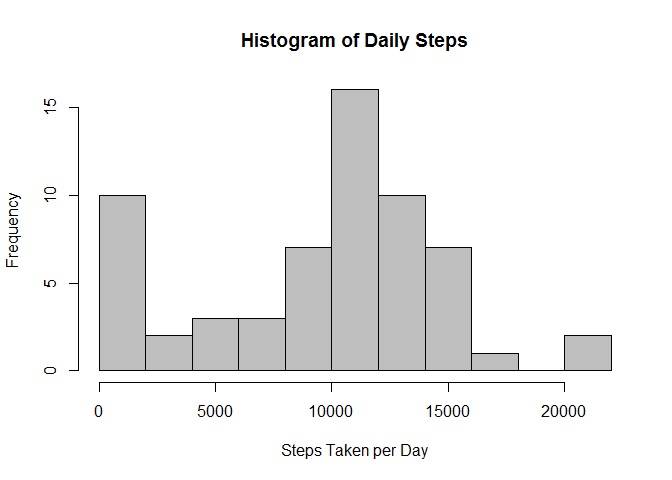
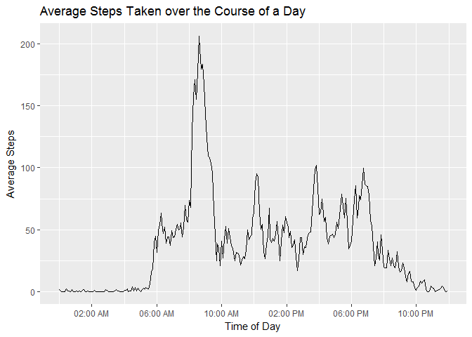
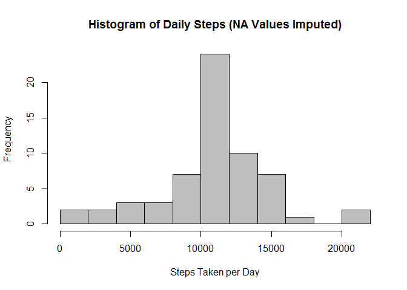
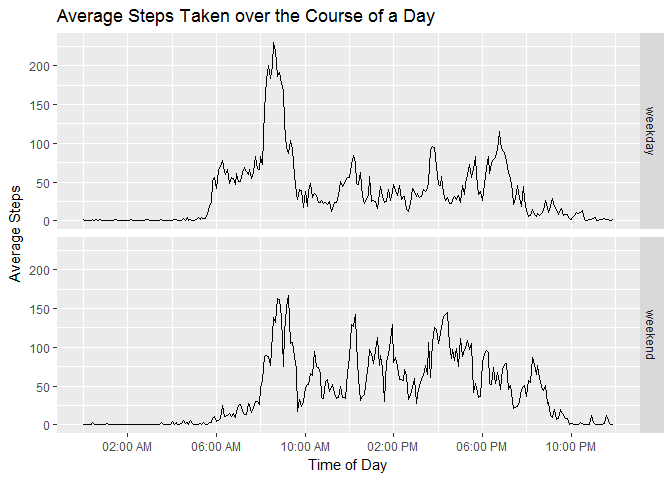

# Reproducible Research: Peer Assessment 1


## Loading and preprocessing the data

```r
library(tidyverse);library(stringr)
options(scipen = 999)
data.activity <- read_csv("activity.csv") %>% 
  mutate(time=sprintf("%04d",as.integer(interval)),
         time=paste0(str_extract(time,"^.{2}"),":",str_extract(time,".{2}$")),
         time.as.posixct=as.POSIXct(time,format = "%H:%M"))
```

After loading the data two new columns were added: time and time.as.posixct.  
*time*, character class, is a reformating of *interval* into human readable HH:MM time format.  
*time.as.posixct*, POSIXct class, reformats *time* for easier ggplot interpretation.


## What is mean total number of steps taken per day?


```r
stat.sum <- data.activity %>% 
  group_by(date) %>% 
  summarise(sum_steps=sum(steps,na.rm=T))
hist(stat.sum$sum_steps,breaks = 15,col = "grey",main = "Histogram of Daily Steps",xlab = "Steps Taken per Day")
```

<!-- -->

```r
steps.mean <- round(mean(stat.sum$sum_steps),2)
steps.median <- median(stat.sum$sum_steps)
```

The mean steps per day is **9354.23** and the median is **10395**

## What is the average daily activity pattern?

```r
stat.time <- data.activity %>% 
  group_by(interval,time,time.as.posixct) %>% 
  summarise(mean_steps=mean(steps,na.rm=T))
 ggplot(stat.time,aes(x=time.as.posixct,y=mean_steps))+
   geom_line()+
   scale_x_datetime(date_breaks='4 hours',date_labels = "%I:%M %p")+
   labs(x="Time of Day",y="Average Steps",title="Average Steps Taken over the Course of a Day")
```

<!-- -->

It should be noted that "Time of Day" is a reformatting of *interval* into a more human readable format.


```r
steps.max <- stat.time[stat.time$mean_steps==max(stat.time$mean_steps),]$interval
steps.max.time <- format(stat.time[stat.time$mean_steps==max(stat.time$mean_steps),]$time.as.posixct,format = "%I:%M %p")
```
The interval with the highest average number of steps is **835**  
Which is **08:35 AM**

## Imputing missing values


```r
n.NA <- sum(is.na(data.activity$steps))
```

There are **2304** missing values in *steps*  
  
NA values will be replaced by the average value for that interval.


```r
data.act.impute <- data.activity %>% 
  left_join(stat.time %>% ungroup() %>% select(interval,mean_steps), by= "interval") %>% 
  mutate(steps=ifelse(is.na(steps),mean_steps,steps))

stat.sum.impute <-data.act.impute %>% 
  group_by(date) %>% 
  summarise(sum_steps=sum(steps)) 

hist(stat.sum.impute$sum_steps,breaks = 15,col = "grey",main = "Histogram of Daily Steps (NA Values Imputed)",xlab = "Steps Taken per Day")
```

<!-- -->

```r
steps.mean.impute <- round(mean(stat.sum.impute$sum_steps),2)
steps.median.impute <- round(median(stat.sum.impute$sum_steps),2)
```

After imputing missing values the mean steps per day is **10766.19** and the median is **10766.19**  
Both values have increased after imputing missing values, which makes sense because we are adding steps that were not orginally recorded.  
Additionally it seems to have reduced the left skew significantly.

## Are there differences in activity patterns between weekdays and weekends?


```r
data.act.impute <- data.act.impute %>% 
  mutate(daytype=factor(ifelse(weekdays(date) %in% c("Saturday","Sunday"),"weekend","weekday")))
stat.time.daytype <- data.act.impute %>% 
  group_by(daytype,interval,time,time.as.posixct) %>% 
  summarise(mean_steps=mean(steps,na.rm=T))
 ggplot(stat.time.daytype,aes(x=time.as.posixct,y=mean_steps))+
   geom_line()+
   scale_x_datetime(date_breaks='4 hours',date_labels = "%I:%M %p")+
   labs(x="Time of Day",y="Average Steps",title="Average Steps Taken over the Course of a Day")+
   facet_grid(daytype~.)
```

<!-- -->

